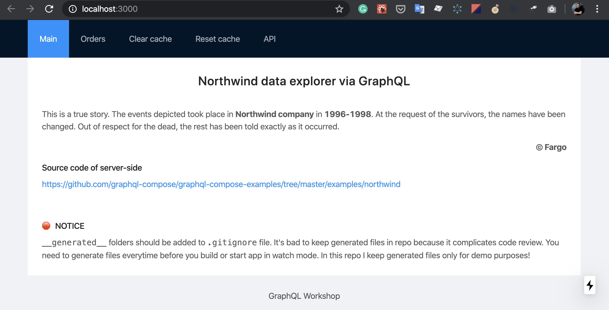
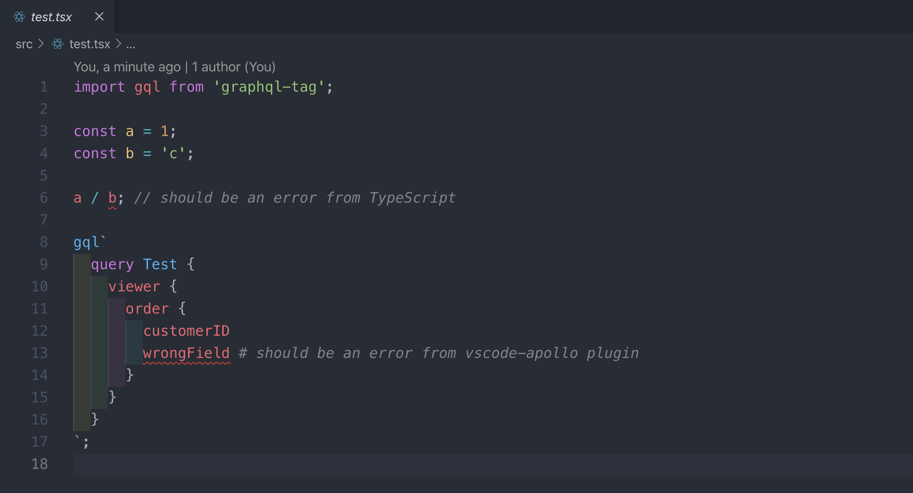
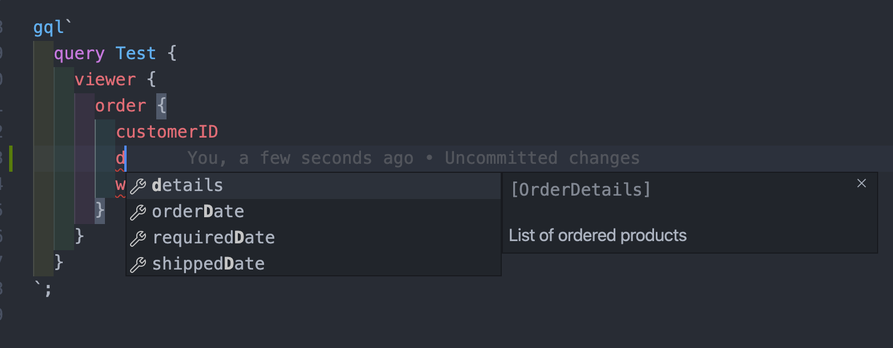

# GraphQL (ApolloClient) Workshop (2020-02)

## 1) Разминка в терминале/консоле

Для того, чтобы не тратить впустую время на воркшопе:

- на установку пакетов
- установку софта и плагинов
- на ожидание интернета, который пригружают соседи

Прошу вас склонировать эту репку:

```bash
git clone https://github.com/nodkz/graphql-workshop-client-2020-02.git
```

Зайти в папку с проектом и **установить пакеты**:

```bash
cd graphql-workshop-client-2020-02
npm install
```

## 2) Проверка приложения

Запустите приложение в терминале `npm run dev`, откройте адрес `http://localhost:3000` и вы должно увидить что-то вроде



## 3) Установка и настройка VSCode

[VSCode](https://code.visualstudio.com/) бесплатен и имеет кучу хороших плагинов. Вобщем поставив и настроив VSCode, вы будите чувствовать себя не хуже чем в Вебшторме, а может быть даже и лучше.

После установки VSCode, необходимо установить следующие расширения:

<!--- `graphql-for-vscode` – (обязательно) для автокомплита GraphQL-запросов. Требует дополнительной установки [Watchman'а](https://facebook.github.io/watchman/docs/install.html) в вашей системе. ☝️ -->

- `vscode-apollo` – (обязательно) для автокомплита GraphQL-запросов
- `vscode-eslint` – (обязательно) для подсветки ошибок, линтинга и форматировании кода через prettier
- `vsliveshare` – (обязательно) позволяет зашарить код и совместно с ним работать. Вы будете подглядывать в мой код. **Обязательно иметь аккаунт на GitHub**, иначе не подключитесь.
- `auto-rename-tag` – чтобы JSX теги переименовывались вместе
- `indent-rainbow` – чтоб красиво красились отступы
- `gitlens` – няшный дополнительный GIT
- `node-module-intellisense` – автоподстановка модулей при импорте
- `zhuangtongfa.material-theme` – тема One Dark Pro, которую я использую для подсветки кода
- `todo-tree` – позволяет быстро находить тудушки по коду
- `vscode-language-babel` – в хозяйстве пригодится
- есть еще что добавить без чего жизнь совсем плоха?! – открой Pull Request

## 4) Проверка VSCode по скриншоту

Если все склонировали, установили пакеты, скачали VSCode и плагины к нему. И перезапустили VSCode после всех установок. То открыв файл `src/test.tsx`, вы должны получить вот такой скриншот с ошибками:

- `a / b; // should be an error` – говорит что c node_modules все нормально и все пакеты через `npm install` установлены. Иначе либо пакеты не установлены, либо отключен встроенный плагин в VSCode по лингтингу тайпскрипта.
- `wrongField # should be an error` – проверяет что плагин к VSCode `vscode-apollo` установлен и работает нормально.



И вот такой скриншот, если начнете набирать имя поля



## 5) И самое главное – установить Telegram к себе на ноутбук

Установите к себе на десктоп [Telegram](https://telegram.org/). Через него я буду отправлять куски кода до того, как они будут попадать в ветку на гитхабе. Это позволит меньше печатать и не отстать от группы.

<!-- Ссылка для присоединения к закрытой группе в телеграмме: <https://t.me/joinchat/A11zfExD66px5q5FvbeOMA> -->
